# KOVA Storefront

KOVA is an e-commerce storefront built as a React.js application (TanStack Start), with a TanStack-first frontend stack, Feature-Sliced Design (FSD), and a contract-first API layer.

This project is intentionally engineered for maintainability. The goal is not only to ship features quickly, but to keep the codebase readable and predictable months or years later.

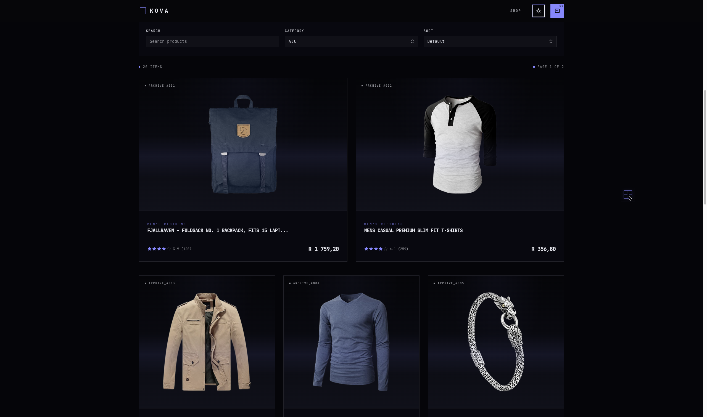

## How we build in an AI agent environment

This repo is developed in an AI-assisted workflow, but with clear constraints and human ownership.

### Agent skills and rules

We use agent skills and engineering rules as operating guides for architecture, testing, data flow, styling, security, and git workflow. In practice, this means the agent is not coding from scratch each time; it is coding against explicit standards.

Why this matters:

- Decisions become repeatable instead of ad-hoc.
- Architectural boundaries are respected even during rapid iteration.
- Team conventions are encoded and reused across milestones.

### Human in the loop (critical)

Agents accelerate implementation, but humans own release decisions.

Milestone flow:

1. Agent implements the milestone using project rules.
2. Agent runs quality checks (`lint`, `typecheck`, `test`, `lint:fsd`).
3. Agent opens a PR for review.
4. Human reviews code, requests changes where needed, and confirms architectural intent.
5. Human merges only when satisfied.

This keeps velocity high without removing accountability.

## Branching strategy

This repo uses a Tier 2 simplified Git Flow that matches our branch-protection hooks in `lefthook.yml`.

- Protected branches: `main`, `master`, and `develop` (direct commits are blocked).
- Day-to-day work happens on short-lived branches (`feature/*`, `fix/*`, `refactor/*`).
- Feature and fix PRs target `develop` as the integration branch.
- Release happens through a single PR from `develop` to `main` when a milestone is ready.
- Hotfixes branch from `main`, then are merged back to both `main` and `develop`.

This gives us one controlled promotion path to production while still allowing incremental fixes on `develop`.

## Guardrails and constant feedback loops

In an AI-driven setup, guardrails are not optional. They are the feedback system that catches drift early.

### Biome

Biome is the formatter/linter baseline for this project.

- Keeps style and linting consistent across contributors (human or agent).
- Catches common correctness and accessibility issues early.
- Reduces noisy diffs so reviews focus on behavior, not formatting.

Config: `biome.json`

### Steiger

Steiger is the architecture linter that enforces FSD boundaries.

- Prevents invalid cross-layer imports.
- Detects structure drift as the codebase grows.
- Keeps slices isolated and composable.

Config: `steiger.config.ts`

### Lefthook

Lefthook enforces pre-commit quality and branch protection.

- Blocks direct commits to protected branches (`main`, `master`, `develop`).
- Runs staged-file Biome checks and TypeScript validation before commit.
- Turns team policy into automated enforcement.

Config: `lefthook.yml`

### TanStack Router CLI (generated route tree)

We rely on TanStack's route generation workflow (`npx @tanstack/router-cli generate`) so route typing and registration stay machine-generated in `src/routeTree.gen.ts`.

- Reduces manual route wiring mistakes during rapid iteration.
- Keeps route IDs/paths in sync with file-based routes.
- Gives AI agents a deterministic source of truth instead of hand-edited route maps.

### CLI-first delivery (`git` + `gh`)

Daily delivery is CLI-first:

- `git` is used for scoped commits, history inspection, and branch hygiene.
- `gh` is used to open and manage PRs from feature branches.
- This keeps release flow scriptable and auditable for both human and agent contributors.

### Editor LSP diagnostics (real-time feedback loop)

LSP (Language Server Protocol) tooling powers in-editor diagnostics from TypeScript, Biome, and other servers while code is being written.

- Surfaces type and lint errors before commit hooks run.
- Shortens the feedback loop for AI-assisted edits.
- Reduces late-stage refactor churn by catching boundary violations early.

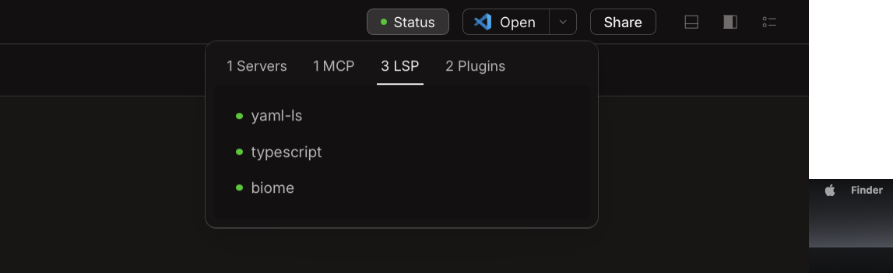

Together, these tools form a continuous feedback loop: write -> validate -> fix -> review.

## Architecture first: Feature-Sliced Design (FSD)

FSD is a frontend architecture approach that organizes code by business purpose and responsibility, not by framework artifact type.

Instead of mixing domain logic, UI rendering, and configuration in the same places, FSD gives each concern a predictable home.

### Why we chose FSD

FSD solves common scaling problems:

- "Where should this code live?" becomes obvious.
- Business logic stops leaking into presentational components.
- Refactors become local to slices instead of rippling through the app.
- New contributors can navigate the repo quickly.

### What each top-level layer means in this repo

| Layer      | What it is                                  | Example in this repo                                                                      |
| ---------- | ------------------------------------------- | ----------------------------------------------------------------------------------------- |
| `app`      | App-wide providers and shell wiring         | `src/app/providers/AppProviders.tsx` wires Query + Lenis                                  |
| `pages`    | Route-level screen composition              | `src/pages/catalog/ui/CatalogPage.tsx` composes catalog screen                            |
| `widgets`  | Large reusable page sections                | `src/widgets/header/ui/Header.tsx`, `src/widgets/cart-sheet/ui/CartSheet.tsx`             |
| `features` | User use-cases and actions                  | `src/features/checkout`, `src/features/catalog-filters`, `src/features/quick-add-to-cart` |
| `entities` | Core domain models and business rules       | `src/entities/product`, `src/entities/cart`, `src/entities/order`                         |
| `shared`   | Cross-cutting infra and reusable primitives | `src/shared/ui`, `src/shared/lib`, `src/shared/api`, `src/shared/config`                  |

### What each slice segment means

Inside a slice (for example `entities/product`), we use consistent segment names:

- `ui`: components that render.
- `model`: hooks/state/handlers that orchestrate behavior.
- `lib`: pure functions and transformations.
- `config`: constants and static settings.
- `api`: network/query boundaries (when needed).
- `index.ts`: public API entry.
- `@x`: explicit cross-entity bridge when entities need to share types.

Example cross-entity bridge:

- `src/entities/product/@x/cart.ts`
- `src/entities/cart/@x/order.ts`

### Data-flow rule we enforce

`component (ui) -> hook (model) -> utility (lib) -> constants (config)`

This keeps components focused on rendering and keeps logic testable.

Concrete chain in this repo:

- `src/entities/product/ui/ProductCard.tsx`
- `src/entities/product/model/useProductCard.ts`
- `src/entities/product/lib/formatProduct.ts`
- `src/entities/product/config/constants.ts`

## Stack decisions: TanStack-first on purpose

We tried to stay in one ecosystem as much as possible.

### Core choices

- TanStack Start: React.js full-stack app runtime.
- TanStack Router: file-based routing + loaders.
- TanStack Query: server-state caching/prefetch.
- TanStack Form: typed checkout form orchestration.
- TanStack Store: lightweight app state (cart/cart sheet).
- TanStack Devtools: visibility during development.

### Why this helps

- Less integration glue between unrelated libraries.
- Better type continuity from route to data to UI.
- Faster onboarding because patterns repeat.

Supporting technologies:

- React 19 + TypeScript
- Vite
- Tailwind CSS v4 + shadcn-style primitives
- Framer Motion + Lenis
- Zod
- Stripe
- Vitest + Testing Library

## API strategy: OpenAPI + Orval

We use a contract-first API workflow.

1. API contract source: `api/fakestore-openapi.yaml`
2. Orval generates typed API functions and query helpers.
3. We expose generated functions through `src/shared/api`.
4. Entities wrap those helpers into app-specific `queryOptions`.

Generated client target:

- `src/shared/api/generated/fakestore.ts`

Why Orval makes our job easier:

- Removes repetitive request boilerplate.
- Keeps type definitions aligned with the API contract.
- Generates query key helpers, reducing key mismatch bugs.
- Lets us focus on business behavior (selection, caching policy, UI states).

### Example: generated helpers wrapped into domain queries

`src/entities/product/api/queries.ts` uses Orval-generated helpers from `src/shared/api`:

```ts
import { getGetProductByIdQueryKey, getProductById } from "@/shared/api";

export const productQueries = {
  detail: (id: number) =>
    queryOptions({
      queryKey: getGetProductByIdQueryKey(id),
      queryFn: () => getProductById(id),
      select: (response) => response.data,
    }),
};
```

This pattern gives us generated transport safety with domain-level control.

## Testability by design: logic extraction in practice

We avoid placing business logic directly inside components, because logic in hooks/libs is easier to verify in isolation.

### How this becomes testable

- Hook handlers can be tested with `renderHook` and mocked boundaries.
- Pure utility functions can be tested deterministically with simple input/output cases.
- Components remain thin render layers, so UI tests stay focused.

### Example 1: Hook-level behavior test

`useProductCardPrefetch` centralizes prefetch handlers in `model/` and is tested directly in:

- `src/entities/product/model/useProductCardPrefetch.ts`
- `src/entities/product/model/useProductCardPrefetch.test.ts`

Test shape (from the repo):

```ts
const { result } = renderHook(() => useProductCardPrefetch({ productId: 7 }));

act(() => {
  result.current.handleProductCardPointerEnter();
  result.current.handleProductCardFocus();
});

expect(prefetchQueryMock).toHaveBeenCalledTimes(2);
```

Because the handler lives in the hook, we can assert behavior without rendering the full card UI.

### Example 2: Pure business-rule test

Cart reward math is implemented in `lib/` and tested in:

- `src/entities/cart/lib/cartRewards.ts`
- `src/entities/cart/lib/cartRewards.test.ts`

Test shape (from the repo):

```ts
expect(getRewardDiscountRate(250)).toBe(0.15);

const snapshot = getCartRewardSnapshot(40);
expect(snapshot.nextTier?.discountRate).toBe(0.05);
expect(snapshot.progressToNextTier).toBeCloseTo(0.53, 2);
```

This is deterministic and easy to reason about because logic is pure and isolated.

### Example 3: Form orchestration test

Checkout submission logic lives in `model/` and is validated in:

- `src/features/checkout/model/useCheckoutForm.ts`
- `src/features/checkout/model/useCheckoutForm.test.ts`

The test verifies invalid form data does not submit, and valid data does.

### Test run evidence

Latest full Vitest run confirms broad coverage across `model/` and `lib/` layers, including the SEO/sitemap additions in this optimization cycle.

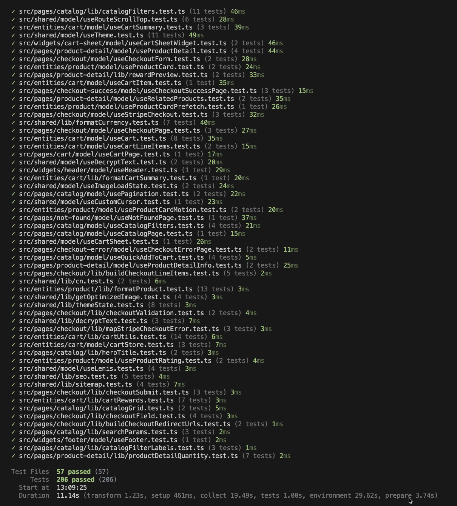

## Checkout reliability: Stripe + Zod

Checkout session creation is implemented as a server function:

- `src/features/stripe/api/createCheckoutSession.ts`

Reliability protections in this boundary:

- Server env validation for `STRIPE_SECRET_KEY` via Zod.
- Payload validation via Zod before handler execution.
- Explicit error mapping and user-facing feedback.

Client orchestration:

- `src/features/stripe/model/useStripeCheckout.ts`
- `src/features/stripe/lib/mapStripeCheckoutError.ts`

This keeps payment flow strict at input boundaries and explicit in failure behavior.

## Stripe test mode and demo credentials

KOVA checkout runs in Stripe sandbox mode for safe testing. No real charges are created by this demo flow.

Use these test details (same pattern shown in the checkout page instructions):

- Card number: `4242 4242 4242 4242`
- Expiry date: any future date (for example `12/34`)
- CVC: any 3 digits (for example `123`)
- Postal code: any valid value (for example `2000`)

The flow below demonstrates both ends of the sandbox journey: hosted Stripe checkout and Stripe Dashboard transaction confirmation.

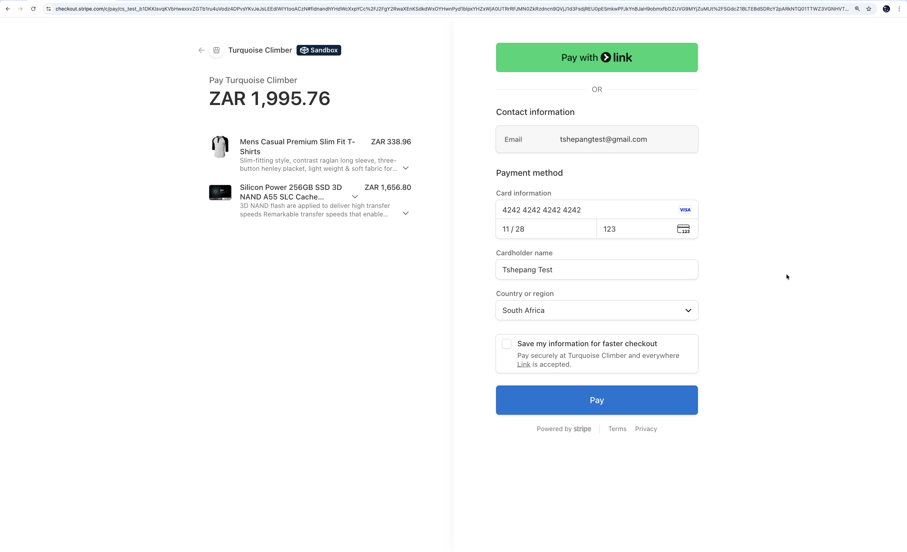

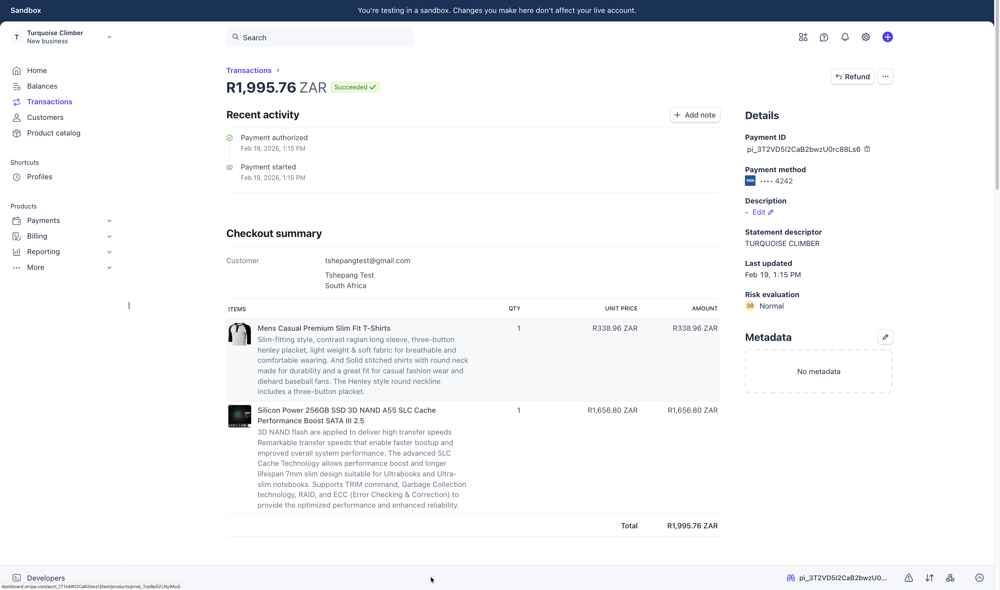

## E-commerce optimizations for speed and flow

Storefront UX quality is tightly coupled to performance and intent-based loading.

### Lighthouse benchmark (latest run)

In the latest landing-page audit, KOVA reached a full Lighthouse score:

- Performance: 100
- Accessibility: 100
- Best Practices: 100
- SEO: 100

We treat this as a benchmark snapshot and continue tuning from there as features evolve.

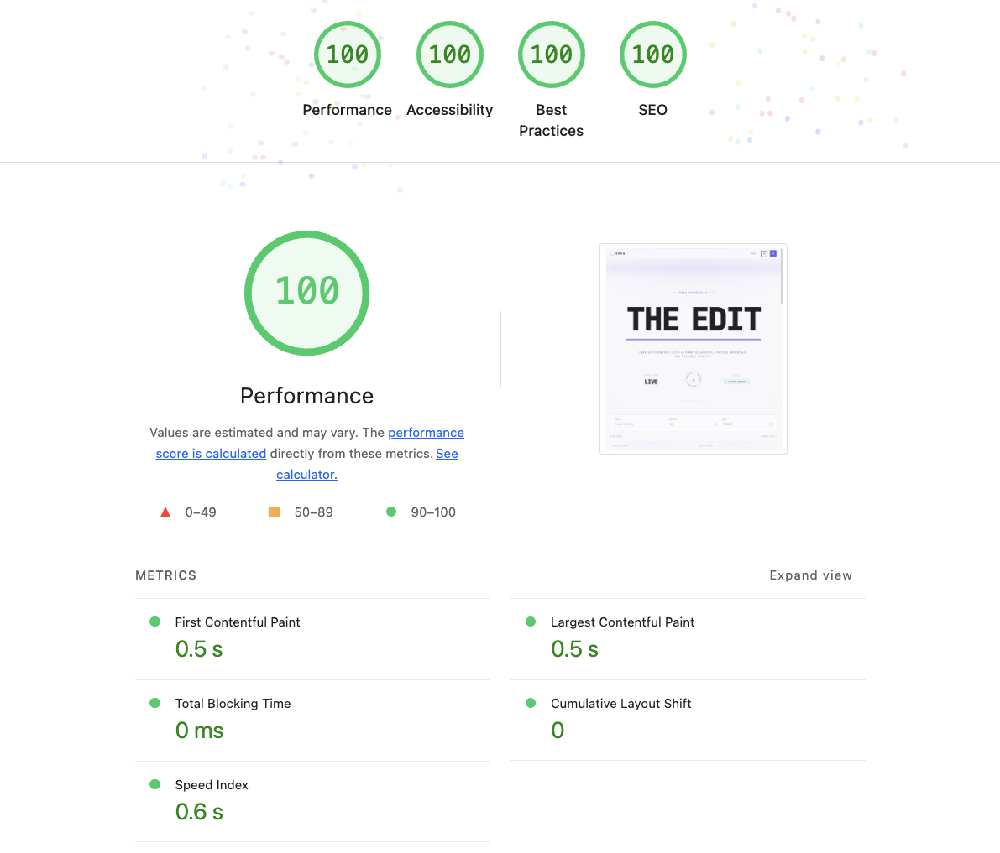

### Progressive rendering architecture

KOVA uses a Server-Side Rendering (SSR) first architecture with progressive region loading on the landing page.

- The initial document renders core structure and above-the-fold context immediately.
- High-priority UI surfaces (layout shell and hero) are shown first.
- Product-heavy regions resolve progressively with stable placeholders, reducing visual instability while data is loading.
- Query prewarming and intent-based prefetch improve continuity when moving from listing to product detail pages.

This follows Partial Prerendering (PPR) principles: prioritize immediate rendering of the critical path, then progressively resolve secondary regions as data becomes available.

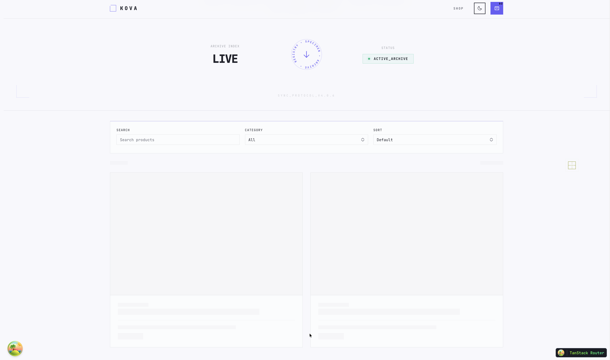

### Image delivery optimization

KOVA currently optimizes remote product media through a URL-based transformation endpoint.

- Responsive image variants are served with `srcset`.
- Images are delivered as WebP with tuned quality settings.
- Loading placeholders keep product and cart layouts stable while assets resolve.
- Public assets are precompressed with gzip and brotli.

In Next.js terms, this differs from the default `next/image` optimization path (`/_next/image`), which commonly uses Sharp in production. We intentionally keep optimization at the remote endpoint instead of running an in-app image processing service.

### Prefetch and route readiness

- Product-detail navigation is pre-warmed so transitions feel immediate.
- Product-card intent handlers prefetch detail data on hover/focus.

### Query caching strategy

- Global cache behavior: `src/shared/api/queryClient.ts`
- Entity-specific stale/cache windows: `src/entities/product/api/queries.ts`

### Search input optimization (debounced URL updates)

Catalog search uses a debounced input pipeline so typing stays responsive without triggering route/search updates on every keystroke.

- Debounce source: `src/features/catalog-filters/config/constants.ts` (`SEARCH_DEBOUNCE_MS = 250`).
- Search orchestration: `src/features/catalog-filters/model/useCatalogFilters.ts`.
- The input state updates immediately, while URL search param updates are delayed intentionally.

Why this helps:

- Reduces unnecessary recomputation and navigation churn.
- Prevents API overfetch patterns when search is backed by a server endpoint.
- Improves query-cache effectiveness because requests are emitted for stable search terms instead of transient partial input.

When search is API-driven, this same pattern maps cleanly to query keys (for example `['products', { q }]`) and lowers request volume, rate-limit pressure, and UI jitter.

### TanStack Query Devtools: prefetch on hover

The project uses intent-based prefetching from product cards (`pointerenter` / focus) so product detail data is already warm by the time users navigate.

- Handler source: `src/entities/product/model/useProductCardPrefetch.ts`
- Test coverage: `src/entities/product/model/useProductCardPrefetch.test.ts`

If you open TanStack Query Devtools while hovering product cards, you can observe prefetching behavior in real time.

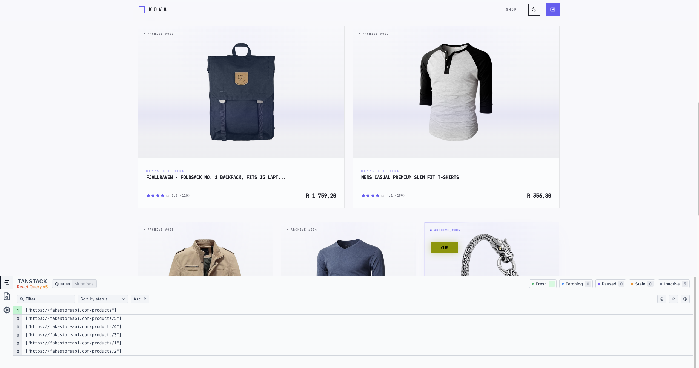

You can also watch the recorded prefetching flow:

Google Drive Link: [Prefetching walkthrough](https://drive.google.com/file/d/1XQEd68BsV2RafnZJYAgCa2iuYm0v97sQ/view?usp=drive_link)

### URL-state and canonicalization

- Catalog filter/sort/pagination state is URL-driven.
- Defaults are stripped for clean, shareable links.

Key files:

- `src/features/catalog-filters/config/searchSchema.ts`
- `src/features/catalog-filters/lib/searchParams.ts`
- `src/routes/index.tsx`

### SEO crawlability: dynamic sitemap and robots

We expose dynamic crawler endpoints from route handlers:

- `src/routes/sitemap[.]xml.ts`
- `src/routes/robots[.]txt.ts`

Why this matters for SEO:

- `sitemap.xml` helps search engines discover canonical product and core commerce URLs quickly.
- `robots.txt` advertises the sitemap location and clarifies crawler policy.
- Both endpoints resolve origin dynamically from the request, so environments stay consistent without hardcoded domains.

### Scroll control and overlay stability

- Lenis owns scroll behavior: `src/app/providers/AppProviders.tsx`
- Router scroll restoration is intentionally disabled: `src/router.tsx`
- Cart sheet coordinates with scroll lock behavior: `src/widgets/cart-sheet/model/useCartSheetWidget.ts`

## Conversion and gamification

This repo includes lightweight gamification tied to cart value progression.

What we implemented:

- Reward tiers at 5%, 10%, and 15%.
- Progress tracking to next reward tier.
- Unlock messaging in cart and product detail contexts.
- Reward-aware checkout line-item handling.

Key files:

- `src/entities/cart/config/constants.ts`
- `src/entities/cart/lib/cartRewards.ts`
- `src/entities/cart/ui/CartSummary.tsx`
- `src/pages/product-detail/lib/rewardPreview.ts`
- `src/entities/order/lib/buildCheckoutLineItems.ts`

The goal is simple: reduce purchase hesitation by making progress visible and actionable.

### Reward visibility at checkout decision points

Gamification is most effective when shoppers can see progress at the exact moment they decide whether to continue browsing or checkout.

In the cart-sheet flow:

- Reward and summary details are visible by default so progress context is immediate.
- Shoppers can collapse details when they want a cleaner view.
- `Go To Checkout` remains visible at all times, even when summary details are collapsed.

This keeps reward momentum visible while preserving a clear path to purchase.

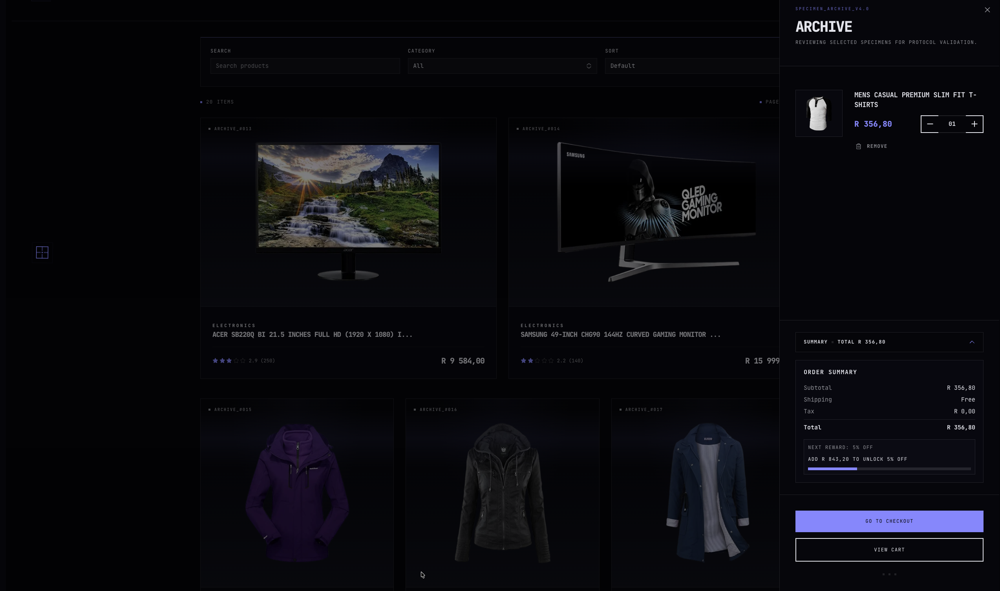

## Motion and interaction language

Motion here is not decorative by default; it is used to support orientation, responsiveness, and product feel.

### Framer Motion

Used across product cards, page sections, sheet transitions, and feedback states.

Examples:

- `src/entities/product/ui/ProductCard.tsx`
- `src/pages/catalog/ui/CatalogHero.tsx`
- `src/widgets/cart-sheet/ui/CartSheet.tsx`
- `src/pages/checkout-success/ui/CheckoutSuccessPage.tsx`

### Lenis

Provides smooth scrolling and more consistent navigation feel.

Examples:

- `src/app/providers/AppProviders.tsx`
- `src/shared/model/useLenis.ts`

### Interaction primitives

- Magnetic interaction: `src/shared/ui/magnetic.tsx`
- Custom cursor: `src/shared/ui/custom-cursor.tsx`
- Image magnifier: `src/shared/ui/image-magnifier.tsx`

## Light mode and dark mode

KOVA supports both light and dark presentation modes. This is not only a visual preference feature; it also improves usability across different ambient conditions and user comfort expectations.

- Dark mode emphasizes the atmospheric "archive" aesthetic and cinematic browsing tone.
- Light mode prioritizes readability during longer browsing and checkout sessions.

Examples:


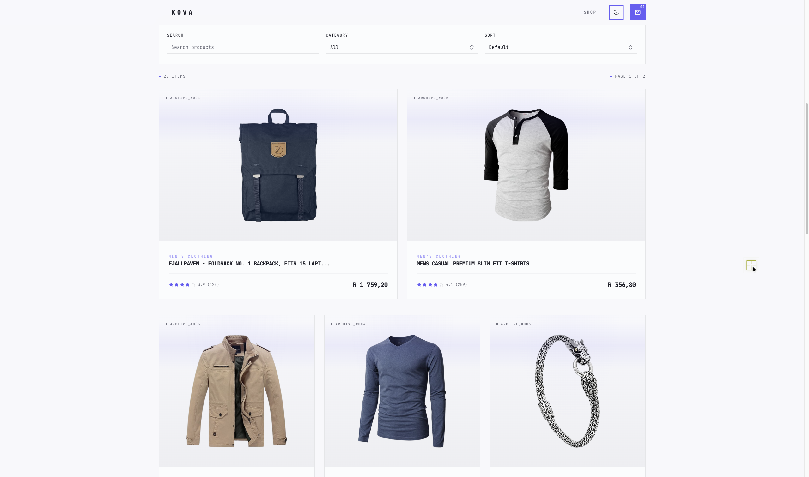

## Getting started

### 1) Install dependencies

```bash
npm install
```

### 2) Configure environment variables

```bash
cp .env.example .env.local
```

Edit `.env.local`:

```bash
STRIPE_SECRET_KEY=sk_test_...
VITE_STRIPE_PUBLIC_KEY=pk_test_...
VITE_SITE_URL=http://localhost:3000
```

Notes:

- Keep `VITE_SITE_URL=http://localhost:3000` for local testing so canonical/OG URL generation stays consistent.
- In deployed environments, set `VITE_SITE_URL` to your production domain (for example `https://your-store.com`).

### 3) Generate API client (when OpenAPI changes)

```bash
npm run generate:api
```

### 4) Start local development

```bash
npm run dev
```

## Scripts

```bash
npm run dev
npm run build
npm run preview
npm run generate:api
npm run lint
npm run lint:fix
npm run typecheck
npm run test
npm run lint:fsd
```

## Screenshot gallery

Most screenshots are grouped here to keep the documentation readable while still giving a full visual walkthrough.

### Landing and catalog


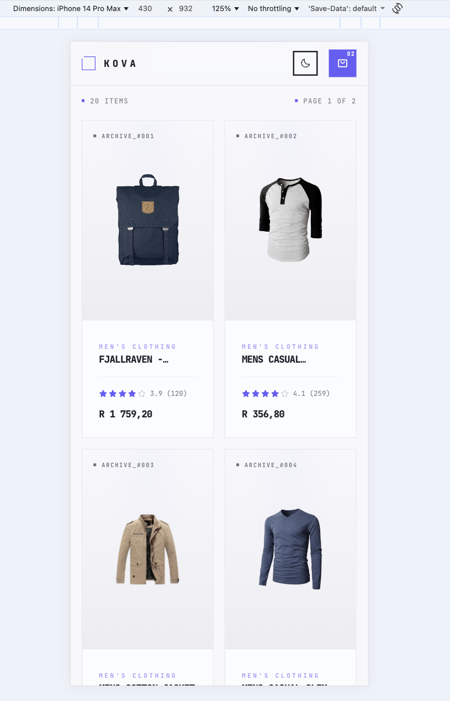

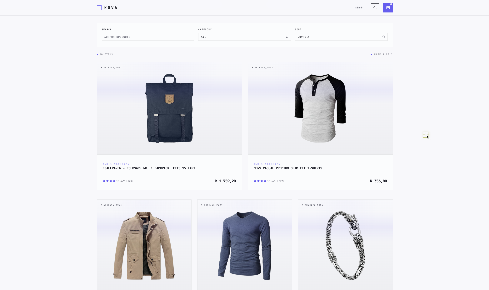

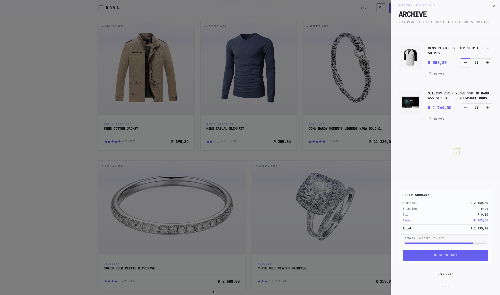

### Product detail and related products

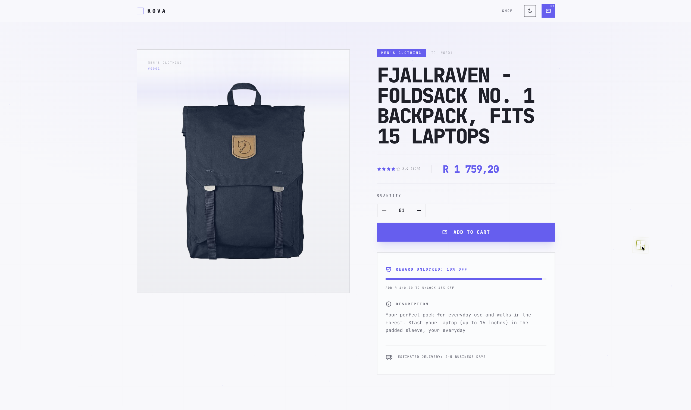

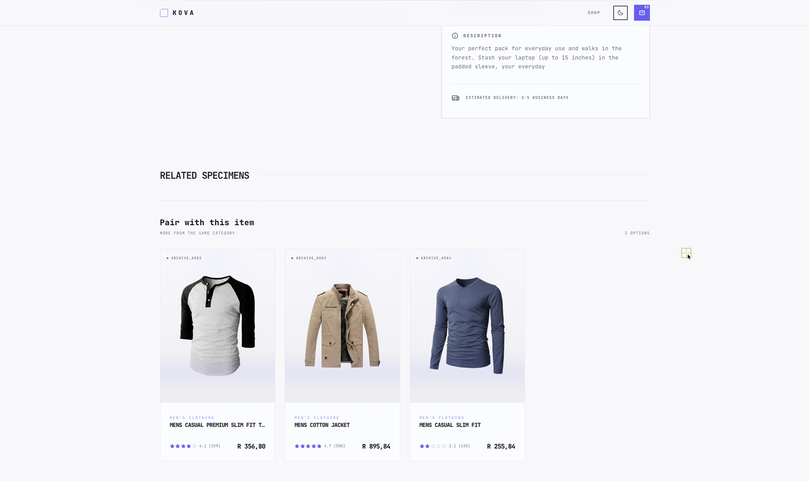

### Cart and checkout journey

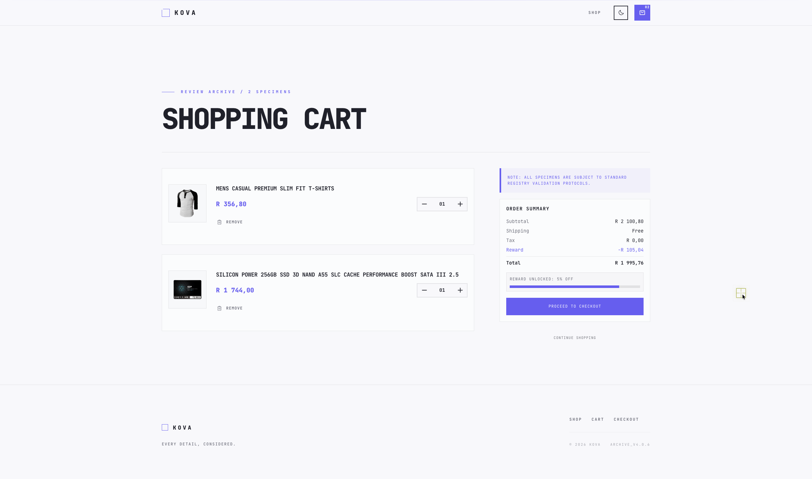

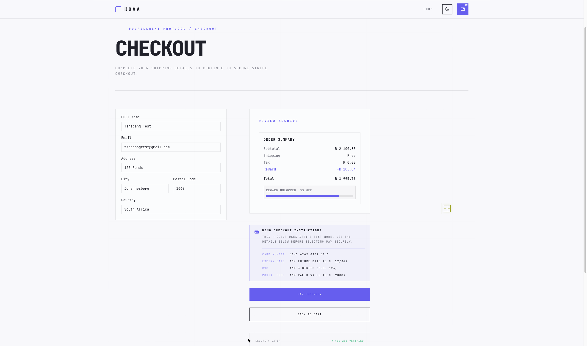

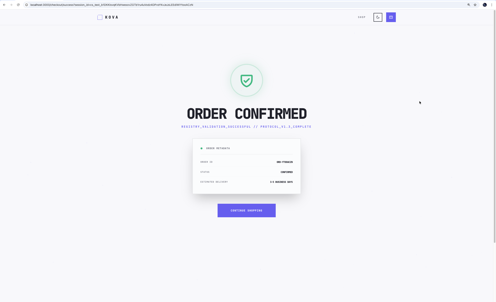

## Final note

KOVA is built for long-term clarity: architecture is intentional, quality is enforced, AI acceleration is guided by rules, and human review remains the final gate.
